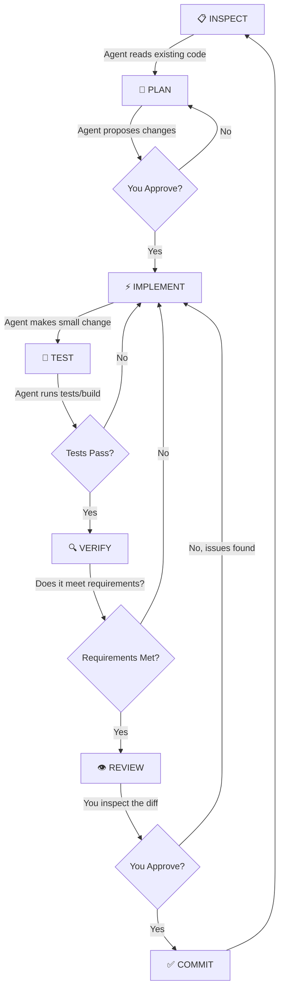

<!-- 📌 WHAT IS THIS FILE? This is the development playbook and best practices guide for building software with Google Antigravity, including workflows, rules, and strategies. -->

# Antigravity Project Development Playbook

> **A practical, research-backed system for building real-world software projects with Google Antigravity — efficiently, reliably, and safely.**

---

## Table of Contents

1. [Executive Summary](#1-executive-summary)
2. [What Antigravity Is & How It Works](#2-what-antigravity-is--how-it-works)
3. [Agent Modes & Capabilities](#3-agent-modes--capabilities)
4. [Agent Selection Guide](#4-agent-selection-guide)
5. [Pre-Project Documentation Strategy](#5-pre-project-documentation-strategy)
6. [Correct Development Sequence](#6-correct-development-sequence)
7. [Prompt Engineering Guide](#7-prompt-engineering-guide)
8. [Common Failure Modes & How to Avoid Them](#8-common-failure-modes--how-to-avoid-them)
9. [Incremental Development Strategy](#9-incremental-development-strategy)
10. [The Inspect→Plan→Implement→Test→Review Loop](#10-the-inspectplanimplementtestreview-loop)
11. [Context Management Strategy](#11-context-management-strategy)
12. [Agent Instruction Files (GEMINI.md / AGENTS.md)](#12-agent-instruction-files)
13. [Git/GitHub Workflow](#13-gitgithub-workflow)
14. [Testing Strategy](#14-testing-strategy)
15. [Security Workflow](#15-security-workflow)
16. [Real Developer Workflows](#16-real-developer-workflows)
17. [Facts vs Opinions Classification](#17-facts-vs-opinions-classification)
18. [The Master Workflow](#18-the-master-workflow)
19. [Agent Cheat Sheet](#19-agent-cheat-sheet)
20. [Reusable Prompt Templates](#20-reusable-prompt-templates)
21. [Recommended Project File Structure](#21-recommended-project-file-structure)
22. [New-Project Checklist](#22-new-project-checklist)
23. [How to Recover from Bad AI Changes](#23-how-to-recover-from-bad-ai-changes)
24. [Debugging Workflow](#24-debugging-workflow)
25. [Sources & References](#25-sources--references)

---

## 1. Executive Summary

This playbook synthesizes research from **official Antigravity documentation**, **community developer experiences**, and **industry best practices** for AI-assisted development. It provides a complete system you can follow for any software project.

### The Core Principle

> **You are the architect and reviewer. Antigravity is your tireless implementation partner.**

The most reliable workflow follows a "human-on-the-loop" model:
1. **You** define what to build (specs, architecture, constraints)
2. **Antigravity** proposes a plan and implements it
3. **You** review, verify, and approve before moving forward
4. **Both** iterate until quality standards are met

### Key Research Findings

| Finding | Source Type |
|---|---|
| Always create a specification before asking the agent to code | **OFFICIAL** + **COMMUNITY** |
| Use `GEMINI.md` / `AGENTS.md` for persistent project rules | **OFFICIAL** |
| Break tasks into the smallest possible units | **COMMUNITY** (strongly validated) |
| Never accept AI code without review — treat it as a junior developer's draft | **COMMUNITY** (universal consensus) |
| Use Planning Mode (`/plan`, `/grill-me`) for complex tasks | **OFFICIAL** |
| Start new conversations for unrelated tasks to prevent context pollution | **COMMUNITY** |
| Run tests immediately after every implementation step | **OFFICIAL** + **COMMUNITY** |
| Use lifecycle hooks for automated guardrails (linting, security scanning) | **OFFICIAL** |

---

## 2. What Antigravity Is & How It Works

### Platform Overview

**Classification: OFFICIAL** — Based on official documentation and built-in skill files.

Google Antigravity is an **agent-first development platform** built by Google DeepMind. Unlike traditional code assistants that only suggest completions, Antigravity deploys autonomous agents that can:

- Read and write files in your workspace
- Run terminal commands (build, test, lint)
- Search the web for documentation
- Launch browser subagents for UI testing
- Create and manage artifacts (plans, reports, analysis)
- Spawn background tasks and subagents
- Schedule recurring tasks
- Use Model Context Protocol (MCP) for external tool integration

### Platform Surfaces

| Surface | Best For | Access |
|---|---|---|
| **Antigravity IDE** | In-editor development with autocomplete, inline commands, and sidebar agent | Standalone VS Code-based IDE |
| **Antigravity 2.0** | Complex orchestration, multi-agent tasks, project management | Desktop Electron app |
| **AGY CLI** | Quick terminal interactions, scripting, CI/CD integration | `agy` command in terminal |
| **Python SDK** | Programmatic agent orchestration, automated pipelines | `pip install google-antigravity` |

### How Agents Interact with Your Codebase

**Classification: OFFICIAL** — From built-in system documentation and tool definitions.

| Capability | How It Works |
|---|---|
| **File Inspection** | Agents use `view_file` to read specific line ranges of any file in your workspace |
| **File Modification** | Agents use `replace_file_content` or `multi_replace_file_content` for precise, targeted edits (not full-file overwrites) |
| **File Creation** | Agents use `write_to_file` to create new files with specified content |
| **Command Execution** | Agents use `run_command` to execute shell commands in your workspace (build, test, install, etc.) |
| **Code Search** | Agents use `grep_search` (ripgrep) for pattern matching across files |
| **Directory Listing** | Agents use `list_dir` to understand project structure |
| **Web Research** | Agents use `search_web` and `read_url_content` for documentation and API lookups |
| **Browser Automation** | Agents launch `browser_subagent` for UI testing and visual verification |
| **Background Tasks** | Long-running commands are managed via `manage_task` with status monitoring |

### How Context Is Provided to Agents

**Classification: OFFICIAL** — From customization system documentation.

```
Priority (Highest → Lowest):
1. Your current message (prompt + @ mentions + attached files)
2. Workspace Project rules (GEMINI.md / AGENTS.md walking up from CWD)
3. Declared Configurations (skills.json, plugins.json)
4. Global Discovery (~/.gemini/config/)
5. Built-in Customizations (bundled skills)
6. Global Declared Configurations
```

> [!IMPORTANT]
> Skills are NOT loaded by default — only their names and descriptions are injected. The full content is loaded only when the agent decides it's relevant or you explicitly request it. This is called **progressive disclosure** and prevents context window pollution.

### Permission & Safety Controls

**Classification: OFFICIAL** — From Antigravity 2.0 settings reference.

| Setting | Options | Description |
|---|---|---|
| **Tool Execution Policy** | `always-proceed`, `request-review`, `strict`, `proceed-in-sandbox` | Controls whether commands need your approval |
| **Terminal Sandbox** | On/Off | Runs agent commands in a restricted environment |
| **Non-Workspace File Access** | `allow`, `ask`, `deny` | Controls reading/writing outside workspace |
| **Internet Access Policy** | `allow`, `ask`, `deny` | Controls network requests |
| **Artifact Review Mode** | `always-proceed`, `agent-decides`, `asks-for-review` | Controls when plans need your approval |

> [!TIP]
> **For learning projects**: Use `request-review` for Tool Execution Policy. This forces you to approve every command, which helps you understand what the agent is doing. As you gain confidence, switch to `always-proceed`.

---

## 3. Agent Modes & Capabilities

### Three Interaction Modalities (Antigravity IDE)

**Classification: OFFICIAL** — From IDE reference documentation.

#### A. Passive: Antigravity Tab (Autocomplete)
- Context-aware code suggestions at your cursor
- Tab to accept, Esc to cancel
- Supercomplete: larger diffs in floating windows
- Tab-to-Jump: anticipates your next navigation point
- Tab-to-Import: auto-adds necessary imports
- **Best for**: Writing code yourself with AI assistance

#### B. Instructive: Inline Command (Ctrl+I)
- Highlight code → Ctrl+I → give instruction
- Refactor, explain, or modify selected code block
- Generate new code at cursor position
- **Best for**: Localized edits, adding comments/docstrings, small refactors

#### C. Collaborative: Sidebar Chat & Agent
- Full multi-step pair programming
- Can read/write files, run commands, search web, use MCP tools
- **Planning Mode**: Creates implementation plans for review before execution
- **Best for**: Complex tasks, new features, debugging, architecture decisions

### Slash Commands

**Classification: OFFICIAL** — From official documentation and built-in system prompt.

| Command | Purpose | When to Use |
|---|---|---|
| `/goal` | Autonomous work until task is complete | Long-running tasks, overnight tasks, comprehensive implementations |
| `/grill-me` | Interactive interview to clarify requirements | Before starting complex features, when requirements are fuzzy |
| `/plan` | Research and create an implementation plan | Before any non-trivial coding task |
| `/schedule` | Set timers or recurring tasks | Automated checks, reminders, recurring operations |
| `/learn` | Persist corrections as rules/skills | After correcting the agent on a pattern you want it to remember |

---

## 4. Agent Selection Guide

**Classification: YOUR RECOMMENDATION** — Synthesized from official capabilities + community practices.

| Task | Recommended Mode | Why | Risk Level | Human Review |
|---|---|---|---|---|
| **Research** | Sidebar Chat | Can search web, read docs, analyze code | 🟢 Low | Optional |
| **Planning** | Sidebar Chat + `/grill-me` or `/plan` | Creates reviewable artifacts | 🟢 Low | **Required** |
| **Architecture Design** | Sidebar Chat | Needs full context and discussion | 🟡 Medium | **Required** |
| **New Feature (Backend)** | Sidebar Agent | Multi-file creation, testing | 🟡 Medium | **Required** |
| **New Feature (Frontend)** | Sidebar Agent + Browser | Creates components, tests in browser | 🟡 Medium | **Required** |
| **Database Design** | Sidebar Chat | Discussion + schema creation | 🟡 Medium | **Required** |
| **Bug Fixing** | Sidebar Agent | Can inspect, diagnose, and fix | 🟡 Medium | **Required** |
| **Refactoring** | Sidebar Agent or Inline (Ctrl+I) | Depends on scope | 🟡 Medium | **Required** |
| **Testing** | Sidebar Agent | Can create and run tests | 🟡 Medium | Review test logic |
| **Code Review** | Sidebar Chat | Read-only analysis | 🟢 Low | N/A |
| **Documentation** | Sidebar Agent or Inline | Can generate comprehensive docs | 🟢 Low | Review accuracy |
| **Security Review** | Sidebar Chat | Analysis only, no changes | 🟢 Low | **Required** (critical) |
| **Performance Optimization** | Sidebar Chat → Agent | Analyze first, then implement | 🔴 High | **Required** |
| **Git Operations** | Sidebar Agent (simple) / Manual (complex) | Simple commits are fine; complex merges need human judgment | 🟡 Medium | Review diffs |
| **Deployment** | Manual + Agent guidance | Agent guides, you execute | 🔴 High | **Required** |
| **Dependency Updates** | Manual | Agent may not know latest compatible versions | 🔴 High | **Required** |

---

## 5. Pre-Project Documentation Strategy

### What to Prepare BEFORE Asking Antigravity to Build Anything

**Classification: YOUR RECOMMENDATION** — Synthesized from official docs (GEMINI.md/AGENTS.md support), community practices (spec-driven development), and industry standards.

### Minimum Structure (Essential)

These files should exist before you write any implementation code:

| File | Purpose | Who/What Uses It | Create When | Update During Dev |
|---|---|---|---|---|
| **`AGENTS.md`** | Persistent agent instructions (coding standards, architecture rules, forbidden patterns) | Antigravity reads this automatically | Before first implementation step | Yes — as patterns emerge |
| **`README.md`** | Project overview, setup instructions | You + anyone reviewing the project | After project setup | Yes — at milestones |
| **`.gitignore`** | Prevent committing secrets, node_modules, etc. | Git | At `git init` | Rarely |
| **`.env.example`** | Document required environment variables (without secrets) | You + agent | Before first env var is needed | Yes |

### Recommended Structure (For Serious Projects)

| File | Purpose | When to Create | Treat as Authoritative? |
|---|---|---|---|
| **`docs/ARCHITECTURE.md`** | High-level system design, data flow, component relationships | After architecture design phase | **Yes** — agent should reference before major changes |
| **`docs/API_SPEC.md`** | API endpoints, request/response formats, auth requirements | Before backend implementation | **Yes** — source of truth for API contracts |
| **`docs/DATABASE_SCHEMA.md`** | Collections, fields, relationships, indexes | Before model implementation | **Yes** — source of truth for data model |
| **`docs/TECH_STACK.md`** | Technologies, versions, and why each was chosen | During planning | Yes |
| **`TASKS.md`** | Current sprint tasks, progress tracking | Before implementation starts | Updated continuously |

### Advanced Structure (Optional — Only If Genuinely Useful)

| File | Purpose | When Useful |
|---|---|---|
| `docs/UI_SPEC.md` | Component hierarchy, page layouts, user flows | Complex frontend applications |
| `docs/DEPLOYMENT.md` | Deployment steps, environment config, secrets management | Before first deployment |
| `docs/TESTING.md` | Testing strategy, coverage requirements | Projects with strict quality requirements |
| `CHANGELOG.md` | Track notable changes | Open source projects or team projects |
| `CONTRIBUTING.md` | Development setup, PR process | Team projects |

### What NOT to Create

> [!WARNING]
> **Do NOT create documentation just to have documentation.** Every file should serve a clear purpose. If the agent doesn't need to read it and you don't need to reference it, it's overhead.

Files that are **unnecessary for a solo learning project**:
- `SECURITY.md` (put security rules in `AGENTS.md` instead)
- `CODE_OF_CONDUCT.md` (solo project)
- `LICENSE` (add later if open-sourcing)
- Separate `REQUIREMENTS.md` (merge into `ARCHITECTURE.md` or `README.md`)

### Example: Minimal `AGENTS.md`

```markdown
# Project Rules

## Project Overview
CollabBoard — a real-time team project management platform.
MERN stack (MongoDB, Express.js, React, Node.js).

## Architecture
- Backend: Express.js REST API in /server
- Frontend: React SPA in /client
- Database: MongoDB with Mongoose ODM

## Coding Standards
- Use ES modules (import/export), not CommonJS (require)
- Use async/await, never raw callbacks
- All API responses follow: { success: boolean, data?: any, message?: string }
- Use httpOnly cookies for JWT, not localStorage
- Every route must have input validation using express-validator
- Every controller must have try/catch with proper error responses

## File Organization
- /server/models/ — Mongoose schemas
- /server/controllers/ — Route handlers (business logic)
- /server/routes/ — Express route definitions
- /server/middleware/ — Auth, validation, error handling
- /server/utils/ — Helper functions
- /client/src/components/ — React components
- /client/src/pages/ — Page-level components
- /client/src/context/ — React Context providers
- /client/src/services/ — API call functions

## Things You Must NEVER Do
- Never store passwords in plain text
- Never commit .env files
- Never use eval() or Function()
- Never disable CORS entirely in production
- Never expose stack traces to clients
- Never install packages without my approval

## Things You Must ALWAYS Do
- Add input validation to every API endpoint
- Include error handling in every async function
- Use meaningful variable and function names
- Add JSDoc comments to utility functions
- Run existing tests after making changes
```

---

## 6. Correct Development Sequence

**Classification: YOUR RECOMMENDATION** — Synthesized from spec-driven development practices, community workflows, and Antigravity's planning mode capabilities.

### The Sequence

```
PHASE 0: FOUNDATION
├── 1. Define the problem clearly
├── 2. List core features (MVP only)
├── 3. Choose tech stack with justification
├── 4. Initialize Git repository
└── 5. Create AGENTS.md with initial rules

PHASE 1: DESIGN (No code yet)
├── 6. Design database schema (docs/DATABASE_SCHEMA.md)
├── 7. Design API endpoints (docs/API_SPEC.md)
├── 8. Design high-level architecture (docs/ARCHITECTURE.md)
├── 9. Define UI pages and user flows
└── 10. Create task breakdown (TASKS.md)
         🔒 CHECKPOINT: Review all designs before proceeding

PHASE 2: BACKEND FOUNDATION
├── 11. Initialize Node.js project + install dependencies
├── 12. Create Express server with basic config
├── 13. Set up MongoDB connection
├── 14. Create .env and .env.example
├── 15. Set up error handling middleware
├── 16. Set up logging
└── 17. Verify: server starts, connects to DB
         🔒 GIT COMMIT: "feat: backend foundation"

PHASE 3: AUTHENTICATION
├── 18. Create User model
├── 19. Implement registration endpoint
├── 20. Implement login endpoint
├── 21. Implement JWT middleware
├── 22. Test auth endpoints with Postman
├── 23. Implement password reset (if needed)
└── 24. Verify: full auth flow works
         🔒 GIT COMMIT: "feat: authentication system"

PHASE 4: CORE BACKEND APIs
├── 25. Create remaining models (one at a time)
├── 26. Implement CRUD for each resource (one at a time)
├── 27. Add authorization middleware
├── 28. Add input validation
├── 29. Test each endpoint with Postman
└── 30. Verify: all core APIs work
         🔒 GIT COMMIT per feature: "feat: workspace API", etc.

PHASE 5: FRONTEND FOUNDATION
├── 31. Initialize React project
├── 32. Set up routing
├── 33. Create layout components
├── 34. Set up API service layer
├── 35. Implement auth pages (login, register)
├── 36. Connect auth to backend
└── 37. Verify: can register, login, and see protected routes
         🔒 GIT COMMIT: "feat: frontend foundation + auth UI"

PHASE 6: FEATURE INTEGRATION
├── 38. Build feature UIs one at a time
├── 39. Connect each UI to its backend API
├── 40. Handle loading/error states
├── 41. Add form validation
└── 42. Verify: each feature works end-to-end
         🔒 GIT COMMIT per feature

PHASE 7: ADVANCED FEATURES
├── 43. Real-time features (Socket.IO)
├── 44. File uploads
├── 45. Dashboard / analytics
├── 46. Search and filtering
└── 47. Verify: advanced features work
         🔒 GIT COMMIT per feature

PHASE 8: POLISH
├── 48. Error boundaries
├── 49. Loading states
├── 50. Responsive design
├── 51. Accessibility basics
└── 52. Performance optimization
         🔒 GIT COMMIT: "chore: polish and UX improvements"

PHASE 9: TESTING
├── 53. Write backend API tests
├── 54. Write frontend component tests
├── 55. Manual end-to-end testing
└── 56. Fix any bugs found
         🔒 GIT COMMIT: "test: add test suite"

PHASE 10: SECURITY REVIEW
├── 57. Run security checklist (see Section 15)
├── 58. Fix vulnerabilities
├── 59. Dependency audit (npm audit)
└── 60. Verify: no critical security issues
         🔒 GIT COMMIT: "security: address vulnerabilities"

PHASE 11: DEPLOYMENT
├── 61. Set up MongoDB Atlas
├── 62. Configure production environment
├── 63. Deploy backend
├── 64. Deploy frontend
├── 65. Smoke testing in production
└── 66. Final documentation update
         🔒 GIT COMMIT: "chore: deployment configuration"
```

### Why This Sequence Works

| Decision | Reasoning |
|---|---|
| **Design before code** | The agent produces better code when it has clear specs to follow |
| **Backend before frontend** | APIs are the contract; frontend consumes them |
| **Auth before features** | Almost every feature needs auth; build it first |
| **One feature at a time** | Reduces bugs, makes testing easier, keeps context clean |
| **Testing after features** | For learning projects, write tests after you understand the feature (TDD is better for production) |
| **Security review before deployment** | Catch issues before they're live |
| **Git commits at milestones** | Creates safe rollback points |

---

## 7. Prompt Engineering Guide

### The Three Levels of Prompting

**Classification: YOUR RECOMMENDATION + COMMUNITY PRACTICE**

### ❌ BAD Prompt — Vague, No Context

```
Build the authentication system for my app.
```

**Why it fails:**
- No tech stack specified → agent guesses
- No architecture constraints → agent creates its own structure
- No security requirements → agent uses defaults (possibly insecure)
- Too broad → produces huge, unverifiable output
- No acceptance criteria → no way to know if it's "done"

---

### ✅ GOOD Prompt — Specific with Context

```
I'm building a MERN stack project management app. The backend is in /server
using Express.js and MongoDB with Mongoose.

Create the User registration endpoint:
- POST /api/auth/register
- Accept: name, email, password
- Hash password with bcrypt (12 salt rounds)
- Store user in MongoDB
- Return JWT token in httpOnly cookie
- Validate inputs using express-validator
- Follow the error response format in AGENTS.md

Only modify files in /server. Do not touch any frontend code.
```

**Why it works:**
- Specifies tech stack and file locations
- Defines exact endpoint with method and path
- Lists acceptance criteria
- Sets constraints (only modify `/server`)
- References existing standards (AGENTS.md)

---

### 🏆 EXCELLENT Prompt — Complete Specification

```
## Task: Implement User Registration Endpoint

## Context
- Project: CollabBoard (MERN stack project management app)
- Backend location: /server
- Database: MongoDB via Mongoose
- Existing files: /server/models/User.js (already created),
  /server/middleware/errorHandler.js (already exists)

## Requirements
- POST /api/auth/register
- Request body: { name: string, email: string, password: string }
- Validation rules:
  - name: required, 2-50 characters, trimmed
  - email: required, valid email format, normalized, unique
  - password: required, minimum 8 characters, must contain letter + number
- Hash password with bcrypt (12 salt rounds)
- Create user document in MongoDB
- Generate JWT with { userId, email } payload, 7-day expiry
- Set JWT in httpOnly, secure, sameSite cookie
- Return: { success: true, data: { user: { id, name, email } } }

## Error Handling
- Duplicate email: 409 Conflict
- Validation errors: 400 Bad Request with field-specific messages
- Server errors: 500 with generic message (no stack trace)

## Constraints
- Only create/modify files in /server/controllers/ and /server/routes/
- Use async/await with try/catch
- Follow the patterns in existing /server/middleware/errorHandler.js
- Do NOT install any new packages

## Verification
After implementation, run: npm test (from /server directory)
If no tests exist yet, test with: curl or show me the Postman request

## What I Do NOT Want
- No localStorage for JWT
- No plain text passwords
- No generic error messages like "Something went wrong"
```

**Why it's excellent:**
- Complete specification with no ambiguity
- Explicit validation rules
- Defined error responses with HTTP status codes
- File boundary constraints
- References existing patterns
- Includes verification step
- Explicit exclusions prevent common mistakes

---

### Prompt Principles

| Principle | Example |
|---|---|
| **Be specific about files** | "Modify `/server/controllers/authController.js`" not "update the auth code" |
| **Set boundaries** | "Only modify files in `/server/routes/`. Do not touch frontend." |
| **Define acceptance criteria** | "The API should return 201 on success with the user object (excluding password)" |
| **Reference existing patterns** | "Follow the error handling pattern in `errorHandler.js`" |
| **Ask for inspection first** | "Before making changes, read the existing code in `/server/models/` and tell me what you find" |
| **Request small changes** | One endpoint per prompt, not "build all the APIs" |
| **Include verification** | "After implementing, run `npm test` and show me the results" |
| **Specify what NOT to do** | "Do not install new packages. Do not modify the database schema." |

---

## 8. Common Failure Modes & How to Avoid Them

**Classification: COMMUNITY PRACTICE + YOUR RECOMMENDATION** — Compiled from multiple developer reports and research.

### Failure Mode 1: Hallucinated APIs / Libraries

| | |
|---|---|
| **Cause** | Agent references a function, method, or npm package that doesn't exist, or uses outdated syntax |
| **Prevention** | Specify exact package versions in AGENTS.md. Tell the agent: "Only use packages already in package.json" |
| **Detection** | `npm install` fails, runtime errors, "X is not a function" errors |
| **Recovery** | Ask agent to check the package documentation. Provide the correct API reference URL |

### Failure Mode 2: Overengineering

| | |
|---|---|
| **Cause** | Agent adds unnecessary abstractions, design patterns, or layers of complexity |
| **Prevention** | Explicitly state: "Keep it simple. Do not add abstractions unless I ask for them." In AGENTS.md: "Prefer simple, readable code over clever patterns." |
| **Detection** | Code review reveals classes/patterns you didn't ask for |
| **Recovery** | Ask agent to simplify. Provide the exact level of abstraction you want |

### Failure Mode 3: Breaking Existing Functionality

| | |
|---|---|
| **Cause** | Agent modifies shared code (utilities, middleware, models) while implementing a new feature, breaking other features |
| **Prevention** | Use file boundary constraints in prompts: "Only modify files in X directory." Always have tests. Always run tests after changes |
| **Detection** | Run full test suite after every change. Manual smoke testing of existing features |
| **Recovery** | `git diff` to see what changed. `git checkout -- <file>` to revert specific files. `git stash` to save changes and test base state |

### Failure Mode 4: Context Drift

| | |
|---|---|
| **Cause** | In long conversations, the agent "forgets" earlier instructions, architecture decisions, or project rules |
| **Prevention** | Keep conversations focused (one feature per conversation). Put persistent rules in AGENTS.md. Start new conversations for new features |
| **Detection** | Agent starts using different patterns or conventions than established |
| **Recovery** | Start a fresh conversation. Re-reference AGENTS.md and architecture docs |

### Failure Mode 5: Security Vulnerabilities

| | |
|---|---|
| **Cause** | Agent uses insecure defaults — storing JWT in localStorage, weak password requirements, missing input validation, SQL/NoSQL injection |
| **Prevention** | Security rules in AGENTS.md. Explicit security requirements in every auth-related prompt |
| **Detection** | Security review checklist (Section 15). Manual audit of auth flows |
| **Recovery** | Fix each vulnerability individually. Re-run security checklist |

### Failure Mode 6: Dependency Bloat

| | |
|---|---|
| **Cause** | Agent installs new packages for functionality that could be done with existing tools |
| **Prevention** | AGENTS.md rule: "Do not install new packages without asking first." Review package.json after every agent session |
| **Detection** | `npm ls --depth=0` to see installed packages. Check if each is actually used |
| **Recovery** | `npm uninstall <unnecessary-package>`. Replace with native/existing solution |

### Failure Mode 7: Incorrect Tests (Self-Confirming)

| | |
|---|---|
| **Cause** | Agent writes tests that match the implementation rather than the specification — the test passes but tests the wrong behavior |
| **Prevention** | Write acceptance criteria BEFORE implementation. Review test assertions manually — do they test the RIGHT thing? |
| **Detection** | Read each test assertion and ask: "Does this test the requirement or just the code?" Intentionally break the code and see if tests catch it |
| **Recovery** | Rewrite tests based on specification, not implementation |

### Failure Mode 8: Environment Variable Mistakes

| | |
|---|---|
| **Cause** | Agent hardcodes values that should be in .env, uses wrong env var names, or forgets to document new env vars |
| **Prevention** | AGENTS.md rule: "All configuration values must use process.env. Always update .env.example when adding new env vars." |
| **Detection** | Grep for hardcoded URLs, ports, secrets. Check .env.example matches .env usage |
| **Recovery** | Extract hardcoded values to .env. Update .env.example |

### Failure Mode 9: Frontend/Backend Contract Mismatch

| | |
|---|---|
| **Cause** | Frontend sends different field names or data structures than what the backend expects |
| **Prevention** | API_SPEC.md as the source of truth. Build backend first, test with Postman, then build frontend to match |
| **Detection** | Network tab in browser DevTools shows 400/422 errors. Console errors about undefined properties |
| **Recovery** | Compare frontend API call with API_SPEC.md. Fix whichever side deviates from the spec |

### Failure Mode 10: Infinite Fix Loops

| | |
|---|---|
| **Cause** | Agent encounters an error, attempts to fix it, creates a new error, attempts to fix that, creates another error — spiraling endlessly |
| **Prevention** | If the agent fails twice on the same problem, stop it. Diagnose the root cause yourself or in a new conversation |
| **Detection** | Agent making 3+ consecutive changes to the same file. Error messages changing but not resolving |
| **Recovery** | `git stash` or `git checkout` to return to last working state. Start a fresh conversation with the error context and your diagnosis |

---

## 9. Incremental Development Strategy

**Classification: COMMUNITY PRACTICE** — Universally recommended across all AI-assisted development resources.

### The Golden Rule

> **Each prompt should result in a change small enough that you can fully understand and verify it in under 15 minutes.**

### Task Decomposition Example

```
❌ BAD: "Build the entire authentication system"

✅ GOOD:
  Epic: Authentication System
  │
  ├── Feature: User Registration
  │   ├── Task 1: Create User model with Mongoose schema
  │   ├── Task 2: Create registration controller with validation
  │   ├── Task 3: Create registration route
  │   ├── Task 4: Test registration with Postman
  │   └── Task 5: Handle duplicate email error
  │
  ├── Feature: User Login
  │   ├── Task 6: Create login controller
  │   ├── Task 7: Create JWT generation utility
  │   ├── Task 8: Set up httpOnly cookie response
  │   ├── Task 9: Create login route
  │   └── Task 10: Test login with Postman
  │
  ├── Feature: Auth Middleware
  │   ├── Task 11: Create JWT verification middleware
  │   ├── Task 12: Create "protect" middleware for routes
  │   ├── Task 13: Test protected route access
  │   └── Task 14: Test expired/invalid token handling
  │
  └── Feature: Password Reset
      ├── Task 15: Create forgot-password endpoint
      ├── Task 16: Create reset-password endpoint
      └── Task 17: Test full password reset flow
```

### Ideal Task Size

| Too Small | Just Right | Too Large |
|---|---|---|
| "Add a comma to line 5" | "Create the User model with these fields..." | "Build the backend" |
| "Import express" | "Create the registration endpoint with validation..." | "Create all the APIs" |
| "Fix the typo" | "Add auth middleware that verifies JWT from cookies..." | "Build the auth system" |

### The Incremental Flow

```
Task N
  ↓
Agent inspects existing code
  ↓
Agent proposes what it will do
  ↓
You approve the plan
  ↓
Agent implements
  ↓
Agent runs tests / build
  ↓
You review the diff
  ↓
You test manually (if applicable)
  ↓
You understand every line
  ↓
Git commit
  ↓
Task N+1
```

---

## 10. The Inspect→Plan→Implement→Test→Review Loop

**Classification: YOUR RECOMMENDATION** — Synthesized from official Planning Mode + community "Plan-Act-Reflect" framework.

### The Loop



### Step-by-Step

#### Step 1 — INSPECT
**What happens**: Before making any changes, the agent reads the relevant existing files.

**Why it matters**: Prevents the agent from duplicating existing functionality, breaking patterns, or creating inconsistent code.

**Prompt approach**: "Before making changes, read the files in `/server/controllers/` and `/server/middleware/` and describe the existing patterns you see."

#### Step 2 — PLAN
**What happens**: The agent explains what it intends to create or modify, which files it will touch, and how its changes fit with existing code.

**Why it matters**: Catches architectural mistakes before they're implemented. Much cheaper to fix a plan than to fix code.

**Prompt approach**: "Based on what you've read, propose a plan for implementing [feature]. List every file you'll create or modify and what changes you'll make in each."

#### Step 3 — IMPLEMENT
**What happens**: After your approval, the agent makes the changes.

**Why it matters**: Implementation should be the shortest step — all the thinking happened in the plan.

**Prompt approach**: "Go ahead and implement the plan. Make only the changes we discussed."

#### Step 4 — TEST
**What happens**: The agent runs automated tests, linting, or the build command.

**Why it matters**: Immediate feedback on whether the implementation is correct.

**Prompt approach**: Include in your AGENTS.md: "After any implementation, run `npm test` from the project root."

#### Step 5 — VERIFY
**What happens**: Check whether the implementation actually satisfies the original requirements (not just whether it "works").

**Why it matters**: Tests can pass while requirements are unmet. A login endpoint that always returns 200 would "pass tests" but not be correct.

**Prompt approach**: "Verify that the implementation meets these acceptance criteria: [list them]."

#### Step 6 — REVIEW
**What happens**: You inspect the git diff, read the new/modified code, and confirm you understand it.

**Why it matters**: This is where you learn and catch issues the agent missed.

**Your action**: `git diff` → read every changed line → ask questions about anything unclear.

---

## 11. Context Management Strategy

**Classification: YOUR RECOMMENDATION** — Synthesized from official progressive disclosure documentation + community context engineering practices.

### The Problem

AI agents have a finite context window. In long conversations or large projects, agents can:
- "Forget" earlier instructions
- Mix up patterns from different parts of the codebase
- Lose track of the overall architecture
- Apply wrong conventions

### The Solution: Layered Context

```
Layer 1: PERSISTENT (Always loaded)
├── AGENTS.md / GEMINI.md — Project rules, conventions, architecture
└── These are automatically loaded by Antigravity on every message

Layer 2: REFERENCED (Loaded when relevant)
├── docs/ARCHITECTURE.md — Referenced at the start of architecture-changing tasks
├── docs/API_SPEC.md — Referenced when building/modifying APIs
├── docs/DATABASE_SCHEMA.md — Referenced when modifying models
└── You explicitly mention these with @file or "read this file first"

Layer 3: TASK-SPECIFIC (In your prompt)
├── Current feature requirements
├── Acceptance criteria
├── File boundaries
└── Specific instructions
```

### Practical Rules

| Rule | Why |
|---|---|
| **One feature per conversation** | Prevents context pollution between unrelated features |
| **Start fresh for new features** | Each feature gets a clean context window |
| **Reference docs explicitly** | "@docs/API_SPEC.md — follow the endpoint contract defined here" |
| **Keep AGENTS.md under 200 lines** | Long instruction files reduce context available for actual work |
| **Use `@` mentions for files** | Provides precise context without loading everything |
| **Repeat critical constraints** | If something is MUST NOT, say it in both AGENTS.md and your prompt |

### What AGENTS.md Should Maintain (Persistent Context)

```
✅ Include:                          ❌ Don't Include:
- Tech stack                        - Full API documentation
- Architecture overview             - Database schema details
- Coding conventions                - Feature requirements
- File organization                 - Implementation plans
- Security rules                    - Bug descriptions
- Error handling patterns           - Deployment instructions
- Naming conventions                - Meeting notes
- Things agent must never do        - Project history
```

### When to Start a New Conversation

| ✅ Start New | ❌ Keep Current |
|---|---|
| New feature / new epic | Follow-up fix for what we just built |
| Switching from backend to frontend | Testing what we just implemented |
| Debugging something unrelated | Adding a related endpoint |
| After 20+ agent turns | Minor adjustments to current work |
| When agent seems "confused" | Reviewing code we just wrote |

---

## 12. Agent Instruction Files

**Classification: OFFICIAL** — GEMINI.md and AGENTS.md are officially supported by Antigravity.

### How It Works

Antigravity automatically discovers and loads rules from:
1. **`GEMINI.md`** or **`AGENTS.md`** placed in any directory
2. The agent walks UP from the current working directory to the repo root
3. Rules apply to the directory they're in and all subdirectories
4. They are deduplicated — a rule file is loaded only once per conversation

### Placement Strategy

```
project-root/
├── AGENTS.md              ← Global project rules (loaded for ALL files)
├── server/
│   └── AGENTS.md          ← Backend-specific rules (loaded when working in /server)
└── client/
    └── AGENTS.md          ← Frontend-specific rules (loaded when working in /client)
```

### Example: Root `AGENTS.md`

```markdown
# CollabBoard Project Rules

## Identity
CollabBoard is a real-time team project management platform.
MERN stack: MongoDB, Express.js, React, Node.js.

## Architecture
- Monorepo: /server (backend) and /client (frontend)
- REST API with JWT authentication via httpOnly cookies
- MongoDB Atlas in production, local MongoDB in development
- Socket.IO for real-time task updates

## Universal Rules
- ES modules everywhere (import/export)
- async/await for all async operations
- Strict TypeScript-like JSDoc annotations on exported functions
- All API responses: { success: boolean, data?: any, message?: string, errors?: any[] }
- HTTP status codes must be semantically correct
- Never log sensitive data (passwords, tokens, full user objects)

## Forbidden
- No eval(), Function(), or dynamic code execution
- No localStorage for authentication tokens
- No inline styles in React (use CSS modules or styled-components)
- No var declarations (use const/let)
- No console.log in production code (use the logger utility)
- No wildcard imports

## Before Making Changes
- Read the relevant existing files first
- Follow existing patterns in the codebase
- Do not install new packages without asking
```

### Example: `server/AGENTS.md`

```markdown
# Backend Rules

## Express Patterns
- Controllers in /server/controllers/ handle business logic
- Routes in /server/routes/ only define route → controller mapping
- Middleware in /server/middleware/ for cross-cutting concerns
- All routes must use the auth middleware for protected endpoints
- All routes must use validation middleware before the controller

## Error Handling
- Always use the AppError class from /server/utils/AppError.js
- The global errorHandler middleware catches all errors
- Never send raw Error objects to the client
- Log errors with the logger, not console.log

## Database
- Models in /server/models/ define Mongoose schemas
- Always use .lean() for read-only queries
- Always select('-password') when returning user data
- Use populate() for referenced documents, limit fields with select
```

---

## 13. Git/GitHub Workflow

**Classification: COMMUNITY PRACTICE** — Standard practices adapted for AI-assisted development.

### Branch Strategy

```
main (production-ready)
  │
  └── develop (integration branch)
       │
       ├── feature/auth-system
       ├── feature/workspace-crud
       ├── feature/task-management
       ├── feature/realtime-updates
       └── fix/login-cookie-issue
```

### For Solo Learning Projects (Simplified)

```
main
  │
  ├── feature/auth        ← one branch per major feature
  ├── feature/workspaces
  └── feature/tasks
```

### The Commit Workflow

```
1. Agent implements a feature/fix
    ↓
2. git diff                        ← Review every line
    ↓
3. git add -p                      ← Stage changes interactively (hunk by hunk)
    ↓
4. Manual verification             ← Test the feature manually
    ↓
5. git commit -m "type: description"
    ↓
6. (If on feature branch) git merge into develop/main when feature is complete
```

### Commit Message Convention

```
feat: add user registration endpoint
fix: resolve JWT expiry check in auth middleware
refactor: extract validation logic to middleware
test: add unit tests for auth controller
docs: update API_SPEC with workspace endpoints
chore: update dependencies
security: hash passwords before storing
style: fix code formatting in userController
```

### Git Milestones

| Milestone | Branch | Commit Message |
|---|---|---|
| Project setup | `main` | `chore: initialize project with Express and React` |
| Database connection | `main` | `feat: add MongoDB connection with Mongoose` |
| Auth system | `feature/auth` → `main` | `feat: complete authentication system` |
| Core feature 1 | `feature/workspaces` → `main` | `feat: workspace CRUD with team management` |
| Core feature 2 | `feature/tasks` → `main` | `feat: task management with kanban boards` |
| Real-time features | `feature/realtime` → `main` | `feat: real-time updates via Socket.IO` |
| Frontend integration | `feature/frontend` → `main` | `feat: React frontend with all features` |
| Testing | `main` | `test: add comprehensive test suite` |
| Deployment | `main` | `chore: deployment configuration` |

### Recovering from Bad Agent Changes

| Situation | Command | Effect |
|---|---|---|
| Agent changed a file badly, not committed | `git checkout -- <file>` | Reverts file to last committed state |
| Agent made many bad changes, not committed | `git checkout .` | Reverts ALL unstaged changes |
| Want to save changes but test without them | `git stash` | Saves changes, returns to clean state |
| Committed bad changes | `git revert HEAD` | Creates a new commit that undoes the last one |
| Want to see what changed | `git diff` | Shows all unstaged changes |
| Want to see staged changes | `git diff --staged` | Shows changes ready to commit |
| Want to undo last commit but keep changes | `git reset --soft HEAD~1` | Uncommits but keeps files modified |

---

## 14. Testing Strategy

**Classification: YOUR RECOMMENDATION** — Synthesized from community TDD practices and AI-specific testing concerns.

### When to Write Tests

| Phase | Testing Approach | Why |
|---|---|---|
| **Learning project** | Write tests AFTER implementation | You need to understand the code before you can test it |
| **Production project** | Write tests BEFORE implementation (TDD) | Tests serve as specification |
| **Bug fixing** | Write a failing test FIRST, then fix | Proves the bug exists and that your fix works |
| **Refactoring** | Ensure tests exist BEFORE refactoring | Proves you didn't break anything |

### Testing Layers for MERN Projects

```
Layer 1: API Tests (Most Important)
├── Test each endpoint with valid inputs → expect correct response
├── Test with invalid inputs → expect validation errors
├── Test unauthorized access → expect 401/403
├── Test edge cases → empty data, duplicate data, large data
└── Tools: Jest + Supertest

Layer 2: Unit Tests (Business Logic)
├── Test utility functions
├── Test middleware functions
├── Test model methods/statics
└── Tools: Jest

Layer 3: Frontend Tests (Components)
├── Test component rendering
├── Test user interactions (clicks, form submissions)
├── Test API integration (with mocked API)
└── Tools: React Testing Library + Jest

Layer 4: Manual Testing (Always Needed)
├── Full user flows in the browser
├── Edge cases that are hard to automate
├── Visual/UX verification
└── Tools: Browser, Postman, DevTools
```

### AI-Specific Testing Concerns

> [!CAUTION]
> **The Biggest Risk**: Agent writes tests that confirm its own (potentially buggy) implementation rather than testing the actual requirements.

**Prevention Strategy:**
1. Write acceptance criteria BEFORE asking the agent to implement
2. After the agent writes tests, read each assertion and ask: "Does this test the *requirement* or just the *code*?"
3. Intentionally break the implementation and verify the tests fail
4. Verify edge cases are covered, not just the "happy path"

---

## 15. Security Workflow

**Classification: YOUR RECOMMENDATION** — Compiled from AI security research, OWASP guidelines, and community practices.

### Pre-Commit Security Checklist

Run this checklist before every deployment and periodically during development:

#### Authentication & Authorization
- [ ] Passwords hashed with bcrypt (≥10 salt rounds)
- [ ] JWT stored in httpOnly, secure, sameSite cookies (NOT localStorage)
- [ ] JWT has reasonable expiry (not > 30 days)
- [ ] Protected routes check authentication
- [ ] Authorization checks verify resource ownership (not just authentication)
- [ ] Password reset tokens expire within 1 hour
- [ ] Failed login attempts don't reveal whether email exists

#### Input Validation
- [ ] All user inputs validated on the server (not just frontend)
- [ ] Email format validated
- [ ] String lengths limited
- [ ] Numbers have min/max bounds
- [ ] File uploads validated (type, size)
- [ ] No eval() or Function() on user input

#### Data Exposure
- [ ] Passwords never returned in API responses (use `select('-password')`)
- [ ] Stack traces not exposed in production error responses
- [ ] Sensitive data not logged
- [ ] .env not committed to Git
- [ ] .env.example doesn't contain real secrets
- [ ] API keys not hardcoded

#### Injection Prevention
- [ ] MongoDB queries use Mongoose (not raw queries with string concatenation)
- [ ] User input not interpolated into queries
- [ ] React automatically escapes JSX (verify no `dangerouslySetInnerHTML` without sanitization)
- [ ] File paths not constructed from user input

#### HTTP Security
- [ ] CORS configured with specific origins (not `*` in production)
- [ ] Helmet.js or equivalent security headers configured
- [ ] Rate limiting on auth endpoints
- [ ] HTTPS in production

#### Dependencies
- [ ] `npm audit` shows no critical vulnerabilities
- [ ] No unnecessary packages installed
- [ ] Packages are from official npm registry (no typosquatting)

---

## 16. Real Developer Workflows

**Classification: COMMUNITY PRACTICE** — Aggregated from Reddit, developer blogs, and community reports.

### Pattern 1: The "Architect-Then-Delegate" Workflow

**Source**: Multiple Reddit and blog posts about Antigravity/AI coding workflows.

```
Developer creates specification document
  ↓
Developer creates AGENTS.md with project rules
  ↓
Developer breaks project into small tasks
  ↓
For each task:
  ├── Developer writes a detailed prompt with acceptance criteria
  ├── Agent implements
  ├── Developer reviews git diff line by line
  ├── Developer tests manually
  ├── Developer commits (or reverts if unsatisfied)
  └── Repeat
```

**What worked**: Specification-first approach eliminated most hallucination issues. Small tasks were consistently higher quality than large ones.

**What didn't work**: Agent sometimes "drifted" from the architecture in long sessions. Fixed by starting new conversations for each feature.

### Pattern 2: The "Plan Mode First" Workflow

**Source**: Antigravity's official recommendation, reinforced by community experience.

```
/plan or /grill-me for every non-trivial task
  ↓
Review the generated plan artifact
  ↓
Approve or refine the plan
  ↓
Agent executes the plan
  ↓
Review and commit
```

**What worked**: Catching architectural mistakes before implementation saved enormous time. The plan artifact served as documentation.

**What didn't work**: Some developers found the planning step slowed them down for trivial tasks. Best reserved for tasks that touch 3+ files.

### Pattern 3: The "Guard Rails" Workflow

**Source**: Community developers using hooks and rules files.

```
Set up AGENTS.md with strict rules
  ↓
Set up hooks.json to auto-lint after every file change
  ↓
Use "request-review" execution policy
  ↓
Agent works within tight constraints
  ↓
Hooks catch formatting/linting issues automatically
  ↓
Human approves only passing changes
```

**What worked**: Automated guardrails caught many issues without human effort. Linting hooks were especially valuable.

**What didn't work**: Overly strict rules sometimes prevented the agent from finding creative solutions.

---

## 17. Facts vs Opinions Classification

Throughout this playbook, recommendations are classified as:

| Label | Meaning | Confidence |
|---|---|---|
| **OFFICIAL** | Explicitly documented in Antigravity's official docs, built-in skills, or system configuration | 🟢 High — use with confidence |
| **COMMUNITY PRACTICE** | Commonly recommended by multiple independent developers across Reddit, blogs, and forums | 🟡 Medium-High — widely validated |
| **EXPERIMENTAL** | Interesting but not sufficiently validated by multiple sources | 🟠 Medium — try cautiously |
| **YOUR RECOMMENDATION** | My synthesis based on all evidence gathered during this research | 🟡 Medium — use as a starting point, adjust based on experience |

### Key Classifications

| Recommendation | Classification |
|---|---|
| Use GEMINI.md / AGENTS.md for project rules | **OFFICIAL** |
| Progressive disclosure of skills | **OFFICIAL** |
| Lifecycle hooks for automation | **OFFICIAL** |
| Slash commands (/goal, /grill-me, /plan, /learn, /schedule) | **OFFICIAL** |
| Tool execution policies (always-proceed, request-review, strict) | **OFFICIAL** |
| MCP server integration | **OFFICIAL** |
| Break tasks into small increments | **COMMUNITY PRACTICE** |
| One feature per conversation | **COMMUNITY PRACTICE** |
| Spec-driven development | **COMMUNITY PRACTICE** |
| Treat agent output as a junior developer's draft | **COMMUNITY PRACTICE** |
| Feature branch per agent task | **COMMUNITY PRACTICE** |
| `git add -p` for reviewing changes hunk by hunk | **COMMUNITY PRACTICE** |
| Security checklist before merge | **COMMUNITY PRACTICE** |
| The inspect→plan→implement→test→review loop | **YOUR RECOMMENDATION** |
| Layered context management strategy | **YOUR RECOMMENDATION** |
| Specific prompt templates in this playbook | **YOUR RECOMMENDATION** |

---

## 18. The Master Workflow

### BEFORE PROJECT

```
 1. Define the problem and target users
 2. List MVP features (ruthlessly cut scope)
 3. Research tech decisions (use Antigravity chat for research)
 4. Create docs/ARCHITECTURE.md
 5. Create docs/DATABASE_SCHEMA.md
 6. Create docs/API_SPEC.md
 7. Create docs/TECH_STACK.md
 8. git init + create .gitignore
 9. Create AGENTS.md with project rules
10. Create .env.example
11. Create TASKS.md with milestone breakdown
12. Initial commit: "chore: project documentation and setup"
```

### DEVELOPMENT (Repeat for Each Task)

```
13. Select next task from TASKS.md
14. Create feature branch (if non-trivial)
15. Write a detailed prompt with:
    - Context (what exists, where)
    - Requirements (what to build)
    - Constraints (what not to touch)
    - Acceptance criteria (how to verify)
16. Agent inspects existing code
17. Agent proposes a plan
18. You review and approve the plan
19. Agent implements
20. Agent runs tests / build / lint
21. You review git diff
22. You test manually (if applicable)
23. git add -p → git commit
24. Update TASKS.md (mark as complete)
25. Update documentation if APIs/schemas changed
```

### AFTER EACH FEATURE

```
26. Run full test suite
27. Manual smoke test of existing features (regression)
28. Check for security issues (quick scan)
29. Update AGENTS.md if new patterns emerged
30. Merge feature branch to main
31. Git commit with descriptive message
```

### BEFORE DEPLOYMENT

```
32. Complete test suite run
33. Security checklist (Section 15)
34. npm audit for dependency vulnerabilities
35. Review all .env variables are set
36. Review CORS and API URL configuration
37. Production build (npm run build)
38. Deploy backend (Render / Railway / etc.)
39. Deploy frontend (Vercel / Netlify / etc.)
40. Set up MongoDB Atlas (if not done)
41. Smoke test in production
42. Update README with deployment info
43. Final commit: "chore: production deployment"
```

---

## 19. Agent Cheat Sheet

| Situation | Mode / Command | Prompt Style | Expected Output |
|---|---|---|---|
| Research a technology | Sidebar Chat | "Research [X]. Explain how it works, when to use it, and how it fits our project." | Analysis document |
| Clarify requirements | `/grill-me` | "I want to build [feature]. Interview me to clarify the requirements." | Requirements list |
| Plan a feature | `/plan` or Planning Mode | "Plan the implementation of [feature] for our project." | Implementation plan artifact |
| Implement a small feature | Sidebar Agent | Detailed prompt with context + constraints + acceptance criteria | Code changes + test run |
| Long autonomous task | `/goal` | "Implement [well-defined feature] according to the plan in the artifact." | Complete implementation |
| Fix a bug | Sidebar Agent | "Bug report: [symptom]. Expected: [X]. Actual: [Y]. Relevant files: [Z]." | Bug fix + explanation |
| Write tests | Sidebar Agent | "Write tests for [file/function]. Test cases: [list expected behaviors]." | Test files |
| Code review | Sidebar Chat | "Review [file] for bugs, security issues, and adherence to project conventions." | Review comments |
| Refactor code | Sidebar Agent or Ctrl+I | "Refactor [function/file] to [goal]. Preserve all existing functionality." | Refactored code |
| Security audit | Sidebar Chat | "Audit [file/directory] for security vulnerabilities. Check the security checklist." | Vulnerability report |
| Documentation | Sidebar Agent | "Generate API documentation for [file/routes] following our docs/API_SPEC.md format." | Documentation |
| Git commit message | Sidebar Chat | "Based on the current git diff, suggest a commit message following conventional commits." | Commit message |
| Learn from correction | `/learn` | After correcting the agent: "Remember this pattern for future tasks." | Persistent rule/skill |

---

## 20. Reusable Prompt Templates

### A. Planning Prompt

```
## Task: Plan [Feature Name]

## Context
- Project: [name] — [brief description]
- Tech stack: [technologies]
- Current state: [what exists so far]
- Architecture: See docs/ARCHITECTURE.md

## Requirements
[List the feature requirements]

## Deliverable
Create an implementation plan that includes:
1. Files to create or modify (with paths)
2. Dependencies needed (if any — prefer existing packages)
3. Database changes (if any)
4. API endpoints (if any)
5. Frontend components (if any)
6. Step-by-step implementation order
7. Potential risks or concerns

## Constraints
- Follow patterns established in AGENTS.md
- Do not propose changes to existing features
- Keep it as simple as possible
```

### B. Feature Implementation Prompt

```
## Task: Implement [Specific Feature/Endpoint/Component]

## Context
- Relevant existing files: [list files agent should read first]
- This feature relates to: [brief context]
- Database model: [reference docs/DATABASE_SCHEMA.md if applicable]
- API contract: [reference docs/API_SPEC.md if applicable]

## Requirements
[Numbered list of specific requirements]

## Acceptance Criteria
- [ ] [Criterion 1]
- [ ] [Criterion 2]
- [ ] [Criterion 3]

## Constraints
- Only modify files in: [directory]
- Do not install new packages
- Follow existing patterns in [reference file]
- Do not modify: [files/features to leave untouched]

## After Implementation
- Run: [test command]
- Verify: [specific verification steps]
```

### C. Bug Fixing Prompt

```
## Bug Report

## Symptom
[What is happening]

## Expected Behavior
[What should happen]

## Steps to Reproduce
1. [Step 1]
2. [Step 2]
3. [Step 3]

## Error Messages
[Paste exact error messages, stack traces, or console output]

## Relevant Files
[List files that are likely involved]

## What I've Tried
[List your debugging attempts]

## Task
1. Inspect the relevant files
2. Identify the root cause
3. Propose a fix (explain before implementing)
4. Implement the minimal fix
5. Run tests to verify the fix doesn't break anything
6. Do NOT refactor or "improve" unrelated code
```

### D. Code Review Prompt

```
## Task: Code Review

## Files to Review
[List specific files or directories]

## Review Criteria
Check for:
1. Bugs or logic errors
2. Security vulnerabilities (see security checklist)
3. Adherence to project conventions (see AGENTS.md)
4. Error handling completeness
5. Input validation
6. Performance concerns
7. Code duplication

## Context
- This code implements: [feature description]
- It should follow the patterns in: [reference files]

## Output Format
For each issue found:
- File and line number
- Severity: Critical / Warning / Suggestion
- Description of the issue
- Suggested fix
```

### E. Refactoring Prompt

```
## Task: Refactor [Component/Function/File]

## Current State
[Describe what the code currently does and why it needs refactoring]

## Goal
[What "better" means specifically — readability? performance? maintainability?]

## Constraints
- All existing functionality MUST be preserved
- All existing tests MUST still pass
- Do not change the public API / function signatures
- Do not change file locations unless specifically asked

## Before Starting
1. Read the current implementation
2. Read any tests that cover this code
3. Describe what changes you plan to make and why
4. Wait for my approval before implementing

## After Refactoring
- Run: [test command]
- Verify: all tests pass
- Show: git diff summary
```

### F. Testing Prompt

```
## Task: Write Tests for [Module/Feature]

## Files to Test
[List specific files]

## Test Requirements
- Test framework: Jest
- Test location: [path]
- Name convention: [filename].test.js

## Test Cases to Cover
1. [Happy path — describe expected behavior]
2. [Invalid input — describe expected error]
3. [Edge case 1]
4. [Edge case 2]
5. [Authorization — describe access control tests]

## Important
- Tests should verify REQUIREMENTS, not just confirm the implementation
- Include both positive and negative test cases
- Mock external dependencies (database, external APIs)
- Each test should be independent (no shared state between tests)

## After Writing Tests
- Run: [test command]
- Show: test results and coverage
```

---

## 21. Recommended Project File Structure

```
project-root/
│
├── 📁 docs/                          [RECOMMENDED]
│   ├── ARCHITECTURE.md               [RECOMMENDED] - System design, data flow
│   ├── API_SPEC.md                   [RECOMMENDED] - API endpoint documentation
│   ├── DATABASE_SCHEMA.md            [RECOMMENDED] - Collections, fields, relationships
│   └── TECH_STACK.md                 [OPTIONAL] - Technologies and why
│
├── 📁 server/                        [ESSENTIAL]
│   ├── 📁 config/                    - Database connection, app config
│   ├── 📁 controllers/               - Route handlers / business logic
│   ├── 📁 middleware/                 - Auth, validation, error handling
│   ├── 📁 models/                    - Mongoose schemas
│   ├── 📁 routes/                    - Express route definitions
│   ├── 📁 utils/                     - Helper functions, error classes
│   ├── 📁 services/                  [OPTIONAL] - Complex business logic
│   ├── 📁 __tests__/                 [RECOMMENDED] - Backend tests
│   ├── server.js                     - Entry point
│   ├── app.js                        - Express app setup
│   ├── package.json                  [ESSENTIAL]
│   └── AGENTS.md                     [RECOMMENDED] - Backend-specific rules
│
├── 📁 client/                        [ESSENTIAL]
│   ├── 📁 public/                    - Static assets
│   ├── 📁 src/
│   │   ├── 📁 components/            - Reusable React components
│   │   ├── 📁 pages/                 - Page-level components
│   │   ├── 📁 context/               - React Context providers
│   │   ├── 📁 hooks/                 - Custom React hooks
│   │   ├── 📁 services/              - API call functions (axios/fetch wrappers)
│   │   ├── 📁 utils/                 - Frontend helpers
│   │   ├── 📁 styles/                - CSS modules or global styles
│   │   ├── App.jsx                   - Root component
│   │   └── main.jsx                  - Entry point
│   ├── package.json                  [ESSENTIAL]
│   └── AGENTS.md                     [RECOMMENDED] - Frontend-specific rules
│
├── 📁 .agents/                       [OPTIONAL] - For advanced Antigravity customizations
│   ├── 📁 skills/                    - Custom agent skills
│   ├── 📁 rules/                     - Additional rule files
│   └── hooks.json                    - Lifecycle hooks (auto-lint, etc.)
│
├── AGENTS.md                         [ESSENTIAL] - Global project rules
├── README.md                         [ESSENTIAL] - Project overview and setup
├── TASKS.md                          [RECOMMENDED] - Current task tracking
├── .gitignore                        [ESSENTIAL]
├── .env.example                      [ESSENTIAL] - Env var documentation
└── package.json                      [ESSENTIAL] - Root package.json (if monorepo scripts)
```

### Classification Legend

| Label | Meaning |
|---|---|
| **[ESSENTIAL]** | Must exist. Project won't function properly without it |
| **[RECOMMENDED]** | Strongly recommended. Makes development significantly smoother |
| **[OPTIONAL]** | Nice to have. Add only if it provides clear value |

---

## 22. New-Project Checklist

Copy this checklist and work through it at the start of every new project:

### Phase 0: Before You Touch Code

- [ ] Problem defined clearly in one paragraph
- [ ] Target users identified
- [ ] Core features listed (MVP only — no feature creep)
- [ ] Tech stack chosen with justification
- [ ] `git init` completed
- [ ] `.gitignore` created (include node_modules, .env, build dirs)
- [ ] `AGENTS.md` created with project rules
- [ ] `.env.example` created
- [ ] `README.md` created with project name and description
- [ ] Initial commit: `git commit -m "chore: initial project setup"`

### Phase 1: Design (No Code)

- [ ] Database schema designed → `docs/DATABASE_SCHEMA.md`
- [ ] API endpoints designed → `docs/API_SPEC.md`
- [ ] Architecture documented → `docs/ARCHITECTURE.md`
- [ ] UI pages/flows sketched (even rough notes)
- [ ] Tasks broken down → `TASKS.md`
- [ ] Design commit: `git commit -m "docs: project design and architecture"`

### Phase 2: Implementation Start

- [ ] Backend project initialized (`npm init`)
- [ ] Core dependencies installed
- [ ] Server connects to database
- [ ] Error handling middleware in place
- [ ] Foundation commit: `git commit -m "feat: backend foundation"`

### Phase 3+: Feature Development

For each feature:
- [ ] Task defined with acceptance criteria
- [ ] Agent given detailed prompt
- [ ] Agent inspected existing code first
- [ ] Agent proposed plan → you approved
- [ ] Implementation complete
- [ ] Tests pass (or manual verification done)
- [ ] `git diff` reviewed — every line understood
- [ ] Feature committed with descriptive message
- [ ] TASKS.md updated

---

## 23. How to Recover from Bad AI Changes

### Decision Tree

```
Did you commit the bad changes?
│
├── NO (changes are unstaged)
│   ├── Single file is bad → git checkout -- <file>
│   ├── Multiple files are bad → git checkout .
│   └── Want to save but test without → git stash
│
├── YES (changes are committed)
│   ├── Last commit only → git revert HEAD
│   ├── Want to undo but keep files → git reset --soft HEAD~1
│   └── Multiple bad commits → git revert <commit-hash> for each
│
└── BAD but you also have GOOD changes mixed in
    ├── git stash → test clean state
    ├── git stash pop → selectively apply good parts
    └── git add -p → stage only good changes
```

### Prevention

| Strategy | How |
|---|---|
| **Commit often** | Small commits = easy reverts |
| **Feature branches** | Bad branch? Delete it. Main is safe |
| **Review before commit** | `git diff` catches problems before they're permanent |
| **Test before commit** | Don't commit broken code |

---

## 24. Debugging Workflow

### Debugging Tools by Layer

| Layer | Tool | What It Shows |
|---|---|---|
| **Frontend** | Browser DevTools (Console tab) | JavaScript errors, warnings |
| **Frontend** | Browser DevTools (Network tab) | API requests, responses, status codes, timing |
| **Frontend** | React DevTools | Component tree, props, state, context |
| **Backend** | Server console logs | Express middleware logs, errors, database queries |
| **Backend** | Postman / Thunder Client | Test API endpoints independently of frontend |
| **Database** | MongoDB Compass / Atlas UI | Inspect documents, run queries, check indexes |
| **Full Stack** | `.env` verification | Environment variable mismatches between frontend/backend |

### Common Error Resolution

| Error | Likely Cause | Fix |
|---|---|---|
| `CORS error` in browser | Backend doesn't allow frontend origin | Add frontend URL to CORS origin config |
| `401 Unauthorized` | JWT missing, expired, or invalid | Check cookie settings, token expiry, middleware |
| `404 Not Found` | Route doesn't exist or wrong method | Verify route definition matches request |
| `500 Internal Server Error` | Unhandled exception in backend | Check server logs, add try/catch |
| `ECONNREFUSED` | Database or server not running | Verify MongoDB is running, check connection string |
| `Cannot read properties of undefined` | Data not loaded yet or wrong shape | Add loading states, check API response structure |
| `Module not found` | Missing dependency or wrong import path | `npm install`, check import spelling/path |

---

## 25. Sources & References

### Official Sources
- [Antigravity Official Documentation](https://antigravity.google/docs) — Primary reference for all platform features
- Built-in Antigravity IDE skill files (`antigravity-guide`, `agy-customizations`) — Agent capabilities, customization system
- [Antigravity Python SDK](https://github.com/google-antigravity/antigravity-sdk-python) — Programmatic agent orchestration

### Community Sources (Multiple Independent Confirmations)
- Reddit communities — Real developer workflows, mistake reports, and best practices
- Medium, Dev.to developer blogs — Spec-driven development, AI coding workflows
- YouTube developer walkthroughs — Visual demonstrations of agent-first development

### Industry Research
- OWASP — Security vulnerability classifications referenced in the security checklist
- Conventional Commits (conventionalcommits.org) — Git commit message standards
- Research papers on AI-generated code security (2025-2026) — 2.74x vulnerability rate finding

### Key Concepts Sourced From
| Concept | Primary Source(s) |
|---|---|
| Progressive disclosure | **OFFICIAL** — Antigravity customization docs |
| GEMINI.md / AGENTS.md hierarchy | **OFFICIAL** — Antigravity rules documentation |
| Lifecycle hooks | **OFFICIAL** — Antigravity hooks documentation |
| Slash commands (/goal, /grill-me, etc.) | **OFFICIAL** — Antigravity documentation |
| Spec-driven development | **COMMUNITY** — Multiple developer blogs and frameworks |
| "Treat AI as a junior developer" | **COMMUNITY** — Universal consensus across platforms |
| Small incremental tasks | **COMMUNITY** — Multiple independent sources |
| Branch-per-task Git strategy | **COMMUNITY** — Standard DevOps practice |
| AI security vulnerability patterns | **INDUSTRY** — Security research papers |

---

> [!IMPORTANT]
> ## How to Use This Playbook
>
> 1. **Before your next project**: Follow the New-Project Checklist (Section 22)
> 2. **During development**: Follow the Master Workflow (Section 18) and the Inspect→Plan→Implement→Test→Review loop (Section 10)
> 3. **When prompting**: Use the Prompt Templates (Section 20) as starting points
> 4. **When something goes wrong**: Check Common Failure Modes (Section 8) and Recovery (Section 23)
> 5. **Before deployment**: Run the Security Checklist (Section 15) and the full test suite
>
> This playbook is a **living document**. Update it as you discover what works and what doesn't for your specific workflow.
