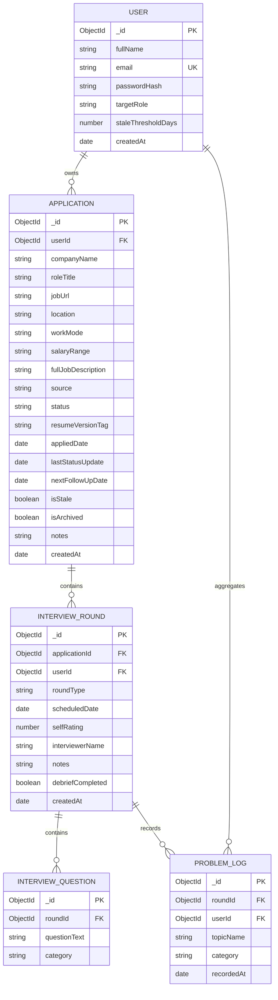
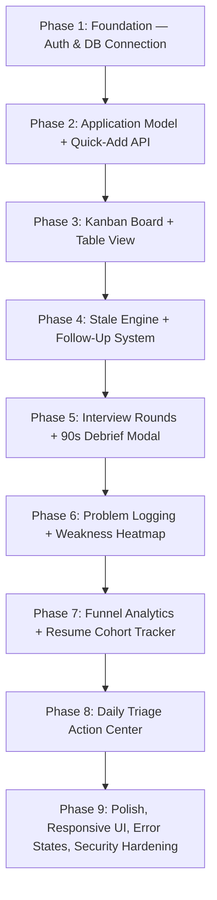

<!-- 📌 WHAT IS THIS FILE? This is the comprehensive product specification defining JobCaliber's core purpose, feature requirements, user personas, UI architecture, and technical principles. -->

# JOBCALIBER — FINAL PRODUCT SPECIFICATION

> **Document Version:** 2.0.0 — Finalized  
> **Status:** ✅ Approved for Development  
> **Last Updated:** 2026-09-24  
> **Target Platform:** Web (Desktop-first Responsive)  
> **Classification:** Definitive Product Specification & Development Blueprint

---

## 1. Executive Summary

### 1.1 What is JobCaliber?

JobCaliber is a **closed-loop job search intelligence system** built on the pure MERN stack. It replaces passive job tracking spreadsheets with an active feedback loop that turns applications, interviews, and rejections into a personalized improvement plan.

### 1.2 The Core Problem

Traditional job trackers (Excel, Notion, even SaaS tools like Teal/Huntr) suffer from two fatal failures:

1. **Tracker Abandonment (within 14–21 days):** Users are asked to fill 10–25 fields per application. When applying to 15+ jobs per day, this becomes a 45-minute bookkeeping chore. They stop.
2. **The Hamster Wheel Trap:** Candidates apply to 200+ jobs using brute-force volume without ever diagnosing *where* in the funnel they are failing (resume vs. interview skills vs. system design knowledge).

### 1.3 How JobCaliber Solves It

```
┌─────────────────┐       ┌─────────────────┐       ┌─────────────────┐
│  Quick-Capture  │ ────► │ Pipeline Funnel  │ ────► │ Post-Interview  │
│ (<15s overhead) │       │ (Drop-off point) │       │  90s Debrief    │
└─────────────────┘       └─────────────────┘       └────────┬────────┘
         ▲                                                   │
         │             ┌───────────────────────┐             │
         └──────────── │ Actionable Study Plan │ ◄───────────┘
                       │ & Weakness Heatmap    │
                       └───────────────────────┘
```

### 1.4 Product Philosophy (Non-Negotiable)

1. **Friction Kills Tracking:** Application capture must take <15 seconds. Only 2 mandatory fields.
2. **No Vanity Dashboards:** Every metric must answer: *"What specific action should I take because of this data?"*
3. **Statistical Honesty:** Strictly separate Facts, User Logs, and System Patterns. Never display conversion percentages when N < 15.
4. **Rejections = Data, Not Failures:** Post-interview debriefs transform rejection into targeted study assignments.

---

## 2. Target Users

| Priority | User Segment | Typical Application Volume | Core Need |
|---|---|---|---|
| **Primary** | College students / freshers / new grads applying for SWE internships & jobs | 100–300+ apps | Track OA dates, log DSA/System Design stumbling blocks, compare resume versions |
| **Secondary** | Self-taught developers / career switchers | 50–100 targeted apps | Resume A/B testing, confidence building through measurable progress |
| **Later** | Experienced mid-senior SWEs | 25–50 selective apps | Multi-round interview management, offer comparison, interviewer notes |

---

## 3. Research Findings Summary

### 3.1 Key Evidence

| Classification | Finding | Source |
|---|---|---|
| `[USER REPORT]` | Users abandon trackers when logging feels like a second job. *"Keep what removes a step, bin what removes one and then adds one."* | Reddit r/jobsearchhacks |
| `[USER REPORT]` | Candidates receive phone screens 3–4 weeks after applying. The job posting has been deleted. They have no idea what the role was about. | Reddit r/recruitinghell |
| `[USER REPORT]` | Visual dashboards filled with red "Rejected" tags feel demoralizing, prompting candidates to avoid opening the app entirely. | Reddit r/jobs |
| `[USER REPORT]` | After failing multiple technical screens, candidates realize every company asked about the same topic (e.g., SQL indexing) — but they never tracked it. | Reddit r/cscareerquestions |
| `[RESEARCH FINDING]` | Names like "JobPulse" and "HireLoop" had widespread market collisions across unrelated bots, apps, and agencies. "JobCaliber" offers a 100% clean, distinct namespace. | Web & Market Search |
| `[RESEARCH FINDING]` | Hundreds of MERN portfolios contain identical "Jobify" clones (Udemy course derivative). Zero differentiation value. | GitHub Repository Audit |
| `[FACT]` | Indian market candidates deal with multi-round OAs (HackerRank, Mettl) before any human interview. Pipeline must include an explicit OA stage. | r/developersIndia |

### 3.2 Competitor Landscape

| Competitor | Strength | Fatal Flaw | Pricing | JobCaliber Advantage |
|---|---|---|---|---|
| **Teal** | Beautiful UI, Chrome extension | Bloated; aggressive $29/mo paywall; AI tools feel generic | $29/mo | Zero paywalls; deep post-interview diagnostics |
| **Huntr** | Clean Kanban | Hard-capped at 40 jobs on free tier; no interview analysis | $40/mo or $14/mo annual | Unlimited applications; relational weakness logging |
| **Simplify** | Autofill browser extension | Privacy/data harvesting concerns; zero analytical insight | Free (data-driven) | Transparent data ownership; analytical depth |
| **Jobscan** | ATS keyword matching | Fake "ATS %" scores; expensive | $49.95/mo | Honest skill comparisons without pseudo-scientific scores |
| **Google Sheets** | Free, private, flexible | High manual friction; no relational data | Free | Relational model (apps → rounds → questions → diagnostics) |
| **Notion** | Aesthetic, customizable | Slow mobile; tedious property management; 80% abandonment | Free/Paid | Purpose-built 15-second entry; automated stale alerts |

---

## 4. The Core Product Loop

```
┌────────────────────────────────────────────────────────┐
│             1. FAST CAPTURE (<15s)                      │
│  Log Company + Role + JD without administrative fatigue │
└───────────────────────────┬────────────────────────────┘
                            │
                            ▼
┌────────────────────────────────────────────────────────┐
│             2. ACTIVE FUNNEL PROGRESSION                │
│  Triage alerts, Stale warnings, Follow-up prompts       │
└───────────────────────────┬────────────────────────────┘
                            │
                            ▼
┌────────────────────────────────────────────────────────┐
│             3. 90-SECOND INTERVIEW DEBRIEF              │
│  Capture questions asked & topics struggled with        │
└───────────────────────────┬────────────────────────────┘
                            │
                            ▼
┌────────────────────────────────────────────────────────┐
│             4. DIAGNOSTIC SYNTHESIS                     │
│  Funnel stage drops & recurring weakness aggregation    │
└───────────────────────────┬────────────────────────────┘
                            │
                            ▼
┌────────────────────────────────────────────────────────┐
│             5. TARGETED REMEDIATION                     │
│  Candidate studies specific failure topics; improves    │
│  interview conversion rate on subsequent applications   │
└────────────────────────────────────────────────────────┘
```

---

## 5. Final Feature List — MVP

These are the **approved, finalized** features for the first version we will build:

### 5.1 Authentication & User Management
- Secure user registration and login
- Passwords hashed with `bcryptjs` (salt rounds = 12)
- JWT stored in `HttpOnly`, `SameSite=Lax`, `Secure` cookies
- User profile: fullName, email, targetRole, staleThresholdDays (default: 21)
- Logout (clears cookie)
- `GET /api/auth/me` — returns current user

### 5.2 Quick-Add Application (<15 Seconds)
- **Only 2 mandatory fields:** `companyName` and `roleTitle`
- **Optional fields** (progressive disclosure via expandable "Add More Details" section):
  - `jobUrl` (auto-pastes from clipboard if URL detected)
  - `location`
  - `workMode` (Remote / Hybrid / Onsite)
  - `salaryRange`
  - `fullJobDescription` (raw text paste — cached snapshot)
  - `source` (LinkedIn, Naukri, Referral, Company Website, etc.)
  - `resumeVersionTag` (string label e.g., "Backend_v2")
  - `appliedDate` (defaults to today)
  - Notes
- **Duplicate Detection:** Warns if same `companyName` + `roleTitle` exists within last 60 days

### 5.3 Application Pipeline (7-Stage Kanban)
- **Fixed system statuses (enum):**
  - `Saved` → `Applied` → `OA / Screening` → `Interviewing` → `Offer` → `Rejected` → `Ghosted`
- Interactive drag-and-drop Kanban board
- Alternative searchable, sortable, paginated **Table/List view** (toggle switch)
- Each card shows: Company, Role, Days in Stage, Resume Tag, Stale Badge

### 5.4 Stale Application Engine
- Applications sitting in `Applied` with no status update for ≥ 21 days get auto-flagged as `isStale`
- User can customize the threshold (7–45 days) in Settings
- One-click actions: "Send Follow-Up", "Mark Ghosted", or "Archive"

### 5.5 Search & Filtering
- **MVP Filters:**
  - Text search across Company / Role
  - Filter by Status
  - Filter by Date Range
  - Filter by Stale flag (show only stale)
- Paginated results

### 5.6 Job Description Snapshot
- Store the full raw JD text in the database
- Accessible from the Application Detail view
- Protects against deleted job postings — user always has a cached copy

### 5.7 Interview Round Logger
- Attached to a specific Application
- Fields: `roundType` (Recruiter, Technical, System Design, HR, OA), `scheduledDate`, `interviewerName` (optional), `notes`
- Multiple rounds per application (chronological timeline)

### 5.8 90-Second Post-Interview Debrief Modal ⭐ (Signature Feature)
- Opens after an interview date passes (banner prompt on dashboard)
- **3-Step Quick Capture:**
  1. **Round Type** — select pill (Recruiter / Technical / System Design / HR)
  2. **Self-Rating** — 1 to 5 stars
  3. **Questions Asked** — free text bullet list (add/remove)
  4. **Stumbled Topics** — tag input with autocomplete from topic taxonomy (e.g., "Dynamic Programming", "SQL Indexing", "Event Loop")
  5. **Freeform Notes** — optional text area
- Atomic database transaction: saves rating, questions, and problem logs in one API call

### 5.9 Stumbled Topic Tagging Engine
- During debrief, user tags specific topics they struggled with
- Two-level taxonomy with custom tag support:

```
TECHNICAL
├── Data Structures & Algorithms
│   ├── Arrays & Strings
│   ├── Trees & Binary Search Trees
│   ├── Graphs (BFS, DFS, Dijkstra)
│   ├── Dynamic Programming
│   └── HashMaps & Heaps
├── System Design & Architecture
│   ├── Scalability & Load Balancing
│   ├── Database Indexing & Sharding
│   ├── Caching (Redis/Memcached)
│   └── API Design (REST/GraphQL)
├── Language & Fundamentals
│   ├── JavaScript (Event Loop, Closures, Async/Await)
│   ├── React (Hooks, State Management)
│   ├── Node.js / Express
│   └── SQL / NoSQL Databases
└── DevOps & Tooling
    ├── Docker & Containers
    └── Git / Version Control

BEHAVIORAL & SOFT SKILLS
├── STAR Method Structuring
├── Conflict Resolution
├── Leadership & Initiative
└── Communication Clarity
```

- Users can also type custom tags not in the taxonomy

### 5.10 Weakness Frequency Heatmap ⭐ (Key Differentiator)
- Aggregates all user-tagged stumbled topics into a ranked list:
  - `SQL Indexing — logged in 4 interviews`
  - `Graph BFS — logged in 3 interviews`
  - `System Design Caching — logged in 2 interviews`
- **Statistical Guardrail:** If total debriefs < 5, display: *"Complete 5 debriefs to reveal recurring patterns (3/5 done)"*
- Visual: Horizontal bar chart (Recharts)

### 5.11 Funnel Conversion & Drop-Off Analytics
- Visual funnel showing:
  - `Applied` → `Screening` → `Interviewing` → `Offer`
  - With absolute counts AND drop-off arrows between stages
- Helps user identify WHERE they are losing (resume problem vs. interview problem)
- **Causal Disclaimer:** All charts labeled: *"Based on your self-reported application data."*

### 5.12 Resume Version Cohort Tracker
- Attach a string label (`resumeVersionTag`) to each application
- Display callback rate comparison across resume versions
- **Statistical Guardrail:** If cohort N < 15, hide percentage. Display: *"Gathering Data (8/15 applications)"*

### 5.13 Daily Triage / Action Center ⭐ (Dashboard Widget)
- Replaces vanity stat counters with max 3 actionable cards:

| Trigger | Generated Action | Severity |
|---|---|---|
| Interview scheduled in next 48h | "Prepare for [Company] [Round] tomorrow" | 🔴 High |
| Debrief not logged within 24h of interview | "Log 90s debrief for [Company] interview" | 🟡 Medium |
| Application stale ≥ 21 days | "[Company] has no activity for 21 days. Follow up or archive?" | 🔵 Medium |
| Topic appeared in ≥ 3 debriefs | "Review [Topic] — flagged in [X] recent debriefs" | 🟣 Low |

- Users can "Dismiss" or "Snooze (7 days)" actions

### 5.14 Secure Authentication & Data Protection
- `express-mongo-sanitize` to prevent NoSQL injection
- `express-rate-limit` on auth endpoints (10 requests per 15 minutes)
- Input validation with `express-validator`
- Every database query scoped to `{ userId: req.user._id }` (tenant isolation)
- XSS protection via input sanitization

### 5.15 Data Export (JSON / CSV)
- One-click full data export from Settings
- Users retain 100% data sovereignty

---

## 6. Features Explicitly REMOVED

These will **NOT** be built in any version:

| Feature | Reason for Removal |
|---|---|
| Automated mass-application bot / auto-submitter | Causes ATS blacklisting; violates ToS; floods market with spam |
| Full networking / recruiter CRM | Over-engineered; alienates student users |
| Calendar replacement | Users already live in Google Calendar; don't rebuild it |
| 0–100% "ATS Compatibility Score" | Pseudo-scientific marketing gimmick; rejected by real hiring managers |
| Daily streak gamification ("5-day apply streak!") | Job search is stressful; streak counters create guilt, not productivity |
| AI Cover Letter Generator | ChatGPT/Claude do this better directly; adds API cost and bloat |
| Company intelligence database | Massive scope creep; better served by Glassdoor |
| LinkedIn scraping | Violates ToS; fragile against DOM changes |

---

## 7. Features Postponed to V2

| Feature | Description |
|---|---|
| **JD Skill Keyword Aggregator** | Parse pasted JDs against a curated 400+ tech term dictionary; show "Skills appearing frequently in your target jobs" |
| **Application Source Analytics** | Compare callback rates: LinkedIn vs. Naukri vs. Referral vs. Company Portal (requires N ≥ 20) |
| **Role Conversion Analytics** | Compare funnel performance: Frontend vs. Backend vs. Fullstack roles |
| **Global Interview Question Bank** | Searchable archive of all questions ever logged, filterable by company/round/topic |
| **Calendar Export (.ics)** | One-click download of interview schedule for import into Google Calendar |
| **Offer Tracking** | Track salary, total compensation, joining date, deadline, benefits |
| **Skill-Gap Profile Comparator** | User self-selects known skills; system highlights "frequently demanded skills you may want to learn" |

---

## 8. Features Postponed to V3

| Feature | Description |
|---|---|
| **Chrome Web Clipper Extension** | One-click JD + application capture from LinkedIn/Indeed |
| **LLM Debrief Assistant** | Optional AI that parses freeform notes into structured topic tags |
| **Mock Interview Study Generator** | Generates practice questions based on user's top weakness topics |
| **Email Status Detection** | Opt-in IMAP/OAuth scan for recruiter response keywords |

---

## 9. Data Model (MongoDB / Mongoose)



### Key Schema Details
- **Application** indexed on: `{ userId: 1, status: 1 }`, `{ userId: 1, companyName: 1, roleTitle: 1 }`, `{ userId: 1, appliedDate: -1 }`
- **Stale calculation:** `lastStatusUpdate < (now - staleThresholdDays)` AND `status IN ('Applied', 'OA / Screening')`
- **ProblemLog** indexed on: `{ userId: 1, topicName: 1 }` — enables cross-application weakness aggregation
- **InterviewRound** indexed on: `{ applicationId: 1, scheduledDate: 1 }`

---

## 10. API Architecture

### Auth (`/api/auth`)
| Method | Endpoint | Description |
|---|---|---|
| `POST` | `/api/auth/register` | User signup; hash password; set JWT cookie |
| `POST` | `/api/auth/login` | Authenticate; set HttpOnly cookie |
| `POST` | `/api/auth/logout` | Clear auth cookie |
| `GET` | `/api/auth/me` | Return current authenticated user |

### Applications (`/api/applications`)
| Method | Endpoint | Description |
|---|---|---|
| `GET` | `/api/applications` | List with filters: status, search, isStale, page, limit |
| `POST` | `/api/applications` | Quick-add (checks for duplicates) |
| `GET` | `/api/applications/:id` | Full detail with populated interview rounds |
| `PATCH` | `/api/applications/:id/status` | Update status; recalculate isStale |
| `PUT` | `/api/applications/:id` | Update application metadata |
| `DELETE` | `/api/applications/:id` | Soft-delete / archive |

### Interviews & Debriefs (`/api/interviews`)
| Method | Endpoint | Description |
|---|---|---|
| `POST` | `/api/applications/:id/interviews` | Create interview round |
| `POST` | `/api/interviews/:roundId/debrief` | Save debrief: rating + questions + problem logs (atomic) |
| `GET` | `/api/interviews/upcoming` | Interviews within next 48 hours (Action Center) |

### Analytics (`/api/analytics`)
| Method | Endpoint | Description |
|---|---|---|
| `GET` | `/api/analytics/funnel` | Aggregation pipeline: stage conversion counts |
| `GET` | `/api/analytics/weaknesses` | ProblemLog grouped by topicName, sorted by count |
| `GET` | `/api/analytics/resume-cohorts` | Response rate by resumeVersionTag (N ≥ 15 guard) |
| `GET` | `/api/analytics/triage` | Active Action Center items |

---

## 11. Frontend Architecture

### Tech Stack
- **Framework:** React 18 + Vite
- **Routing:** React Router v6 (protected route wrapper)
- **State Management:** React Context API (`AuthContext`, `ApplicationContext`) + `useState` / `useReducer`
- **Styling:** Tailwind CSS — dark-mode first, glassmorphism surfaces, vibrant accent colors
- **Charts:** Recharts — Funnel bar chart + Weakness horizontal bar
- **Drag-and-Drop:** `@hello-pangea/dnd` (maintained fork of `react-beautiful-dnd`)

### Page Architecture

```
┌──────────────────────────────────────────────────────────────────┐
│ NAVIGATION: [Logo] | Dashboard | Pipeline | Analytics | Settings │
└──────────────────────────────────────────────────────────────────┘

[1. DASHBOARD]
├── Top Row: Action Center (max 3 tactical cards)
├── Middle: Pipeline Overview (Kanban mini-view or summary counts)
└── Bottom: Weakness Snapshot + Funnel Quick-View

[2. PIPELINE VIEW (Kanban / Table Toggle)]
├── Filter Bar: Search, Status, Date Range, Stale Toggle
├── Kanban Board: 7 columns with drag-and-drop cards
└── Table View: Dense sortable list with inline status dropdown

[3. APPLICATION DETAIL (Modal or Slide-Over)]
├── Header: Company, Role, Status dropdown, Applied Date, Stale Badge
├── Job Description: Expandable cached raw text
├── Interview Timeline: Chronological list of rounds + debriefs
├── Notes & Contacts: Freeform scratchpad
└── Actions: Add Round, Log Debrief, Mark Ghosted, Archive, Delete

[4. ANALYTICS PAGE]
├── Funnel Conversion Chart (Applied → Screen → Interview → Offer)
├── Weakness Frequency Heatmap (ranked bar chart)
└── Resume Cohort Comparison (table with N-guard)

[5. SETTINGS]
├── Profile: Name, Email, Target Role
├── Stale Threshold: Custom days slider (7–45)
└── Export Data: JSON / CSV download
```

---

## 12. Statistical Guardrails (Mandatory Product Rules)

### The Three-Tier Truth Classification
Every insight must be explicitly labeled:
1. **`[FACT]`** — What the user explicitly recorded (e.g., "14 applications submitted")
2. **`[USER LOG]`** — What the user self-reported (e.g., "Struggled with Graph BFS in 3 rounds")
3. **`[SYSTEM PATTERN]`** — What the data shows when aggregated (e.g., "Referrals converted at 42%, LinkedIn at 9%")

The system **NEVER** says: *"You were rejected because you are bad at Graphs."*
Instead: *"Graph-related difficulties were recorded in 4 technical interview debriefs."*

### Sample Size Protection
| Metric | Minimum N | Below Threshold Display |
|---|---|---|
| Resume Cohort Conversion Rate | 15 applications per cohort | *"Gathering Data (8/15 applications)"* |
| Weakness Pattern Ranking | 5 total debriefs | *"Complete 5 debriefs to reveal patterns (3/5)"* |
| Source Conversion (V2) | 20 applications per source | *"Not enough data yet (12/20)"* |

---

## 13. Security Architecture

1. **Password Hashing:** bcrypt with salt rounds = 12
2. **Token Transport:** JWT in `HttpOnly`, `SameSite=Lax`, `Secure` (production) cookies — inaccessible to client JS
3. **NoSQL Injection Defense:** `express-mongo-sanitize` strips `$` and `.` operators
4. **Input Validation:** `express-validator` on all payload endpoints
5. **Rate Limiting:** `express-rate-limit` — 10 login attempts per 15 minutes
6. **Tenant Isolation:** Every query includes `{ userId: req.user._id }`
7. **Data Export & Deletion:** One-click export (JSON/CSV) + full account purge option

---

## 14. Development Roadmap (Antigravity Incremental Phases)



### Development Rules
- **Small batches:** One controller / route / component at a time
- **No unfamiliar tools:** Strictly pure MERN + Tailwind CSS
- **Verify each step:** Test API with curl/Postman, confirm frontend rendering before moving on
- **Human-in-the-loop:** User reviews and approves before each phase begins

---

## 15. Differentiation Matrix

| Dimension | "Jobify" Clone | Teal / Huntr | **JobCaliber** |
|---|---|---|---|
| Core Value | Basic CRUD form | Application board + paywalled tools | **Closed-loop diagnostic feedback system** |
| Interview Handling | Status changes to "Interview". Nothing else. | Logs date and notes | **90s Debrief linking questions to recurring weaknesses** |
| Analytics | Simple bar chart of totals | Basic metrics behind paywall | **Funnel drop-off + sample-size guarded weakness heatmap** |
| Daily Utility | Passive database | Cluttered with upsells | **Daily Triage: today's 3 most important actions** |
| Statistical Rigor | None | Fake "ATS %" scores | **N ≥ 15 guardrails preventing false conclusions** |
| Cost | Free | $29–$40/month | **Free & open-source** |

---

## 16. What Makes This Resume-Worthy (Not Another CRUD App)

1. **MongoDB Aggregation Pipelines** — Complex `$group`, `$match`, `$lookup` queries for funnel analytics and weakness frequency calculations
2. **Statistical Sample-Size Thresholds** — Architectural maturity beyond naive percentage displays
3. **Relational Data Model** — Applications → Interview Rounds → Questions → Problem Logs (not flat CRUD)
4. **Secure HttpOnly Cookie Authentication** — Production-grade JWT transport
5. **Operational Daily Triage Engine** — Rule-based actionable alert generation
6. **Drag-and-Drop Kanban** — Interactive pipeline with real-time status transitions

---

## 17. Product Name Decision

**Decision: "JobCaliber"**

- Full branding: **JobCaliber — Measure your pipeline. Elevate your interview caliber.**
- Dual Meaning: Precision measurement of conversion metrics + elevating user interview standards.
- Distinct & Uncontested: 0 competing job tracking or career analytics SaaS tools. Clean developer portfolio branding.

---

## 18. Technology Stack (Final)

| Layer | Technology | Rationale |
|---|---|---|
| **Frontend** | React 18 + Vite | Fast build times, SPA architecture, industry standard |
| **Styling** | Tailwind CSS | Dark-mode first, glassmorphism, responsive, rapid prototyping |
| **Charts** | Recharts | Native React SVG, responsive containers, fluid animations |
| **Drag & Drop** | @hello-pangea/dnd | Maintained, accessible fork of react-beautiful-dnd |
| **Backend** | Node.js + Express.js | Non-blocking I/O, native JS end-to-end |
| **Database** | MongoDB + Mongoose | Document model fits nested interview/question data |
| **Auth** | JWT + bcryptjs | Stateless, secure HttpOnly cookie transport |
| **Date Utils** | date-fns | Lightweight, modular, immutable date math |
| **Validation** | express-validator | Server-side input validation |
| **Security** | express-mongo-sanitize, express-rate-limit | NoSQL injection defense, brute-force prevention |

---

## 19. Open Questions (Resolved)

| Question | Decision |
|---|---|
| Monorepo or split repos? | **Monorepo** — `client/` and `server/` in single repo for simplicity |
| Resume storage: label-only or file upload? | **Label-only for MVP** — string tag like "Backend_v2". No S3/Cloudinary needed. |
| Topic taxonomy scope? | **Software Engineering focused for MVP** — DSA, System Design, Web Dev, Behavioral. DevOps tags included. |
| Status: fixed or customizable? | **Fixed enum** — guarantees consistent aggregation pipelines |
| Stale threshold: fixed or customizable? | **Customizable** — default 21 days, user adjustable 7–45 days in Settings |
